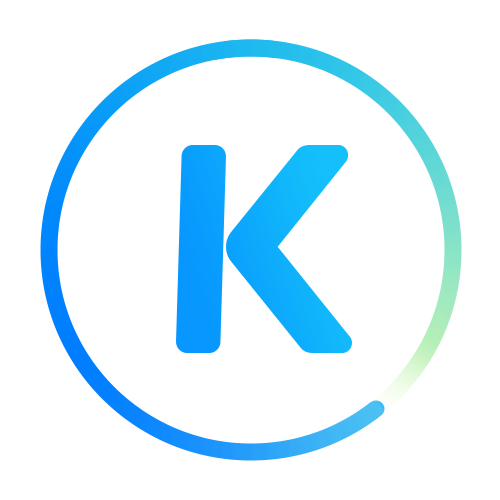
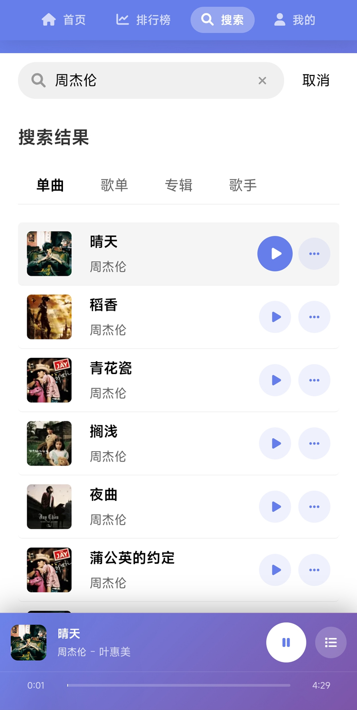
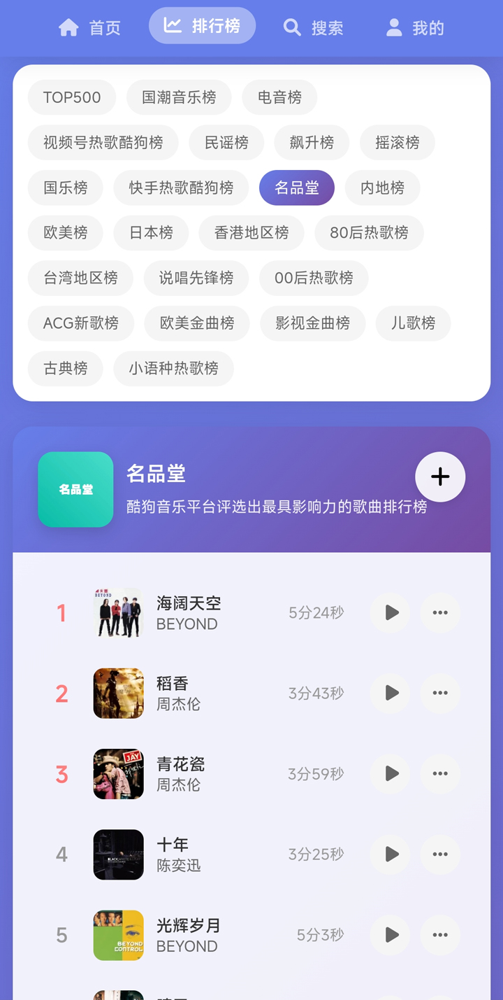
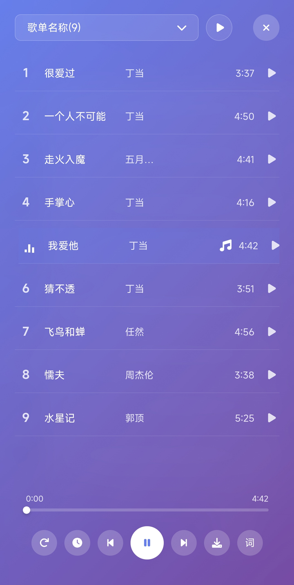

<br />
<p align="center">
    
  <h2 align="center" style="font-weight: 600">MoeKoe Music Mobile</h2>

  <p align="center">
    适配移动端的开源简洁酷狗第三方播放器
	    <br />
	本项目基于 [MoeKoeMusic/MoeKoeMusic](https://github.com/MoeKoeMusic/MoeKoeMusic) 项目修改而来，专注于移动端体验优化和功能改进。

  </p>
</p>

## 📸 界面展示

<p align="center">
  
  
  
  
</p>

<p align="center">
  
  
  
  
</p>

## 📝 项目说明

### 📱 核心特性
- ✅ 使用 Vue.js 全家桶开发，专注移动端体验
- 🔴 账号登录支持
- 📃 支持歌词显示
- 📻 每日推荐歌曲
- 🚫🤝 去掉任何社交功能
- 🔗 官方服务器直连
- ✔️ VIP 功能支持
- 🎨 响应式设计，完美适配各种手机屏幕
- 🔍 强大的音乐搜索功能
- ✔️ 实时更新的音乐排行榜
- ✔️ 丰富的歌单推荐


## 📦️ 安装部署

### 1. 本地开发环境
#### 1.1 克隆代码仓库
```bash
git clone https://github.com/lijsjust2/MoeKoeG.git
cd MoeKoeG
```

#### 1.2 安装项目依赖
```bash
npm run install-all
```

#### 1.3 启动服务
- 启动 API 服务
  ```bash
  npm run api
  ```

- 启动移动端开发服务器
  ```bash
  npm run mobile
  ```

#### 1.4 访问应用
| 服务类型       | 访问地址                |
|----------------|-------------------------|
| 移动端前端     | `http://localhost:8880` |
| API 服务       | `http://localhost:6521` |

### 2. Docker 部署
⚠️ 注意：部署后需开放服务器对应端口（8880/6521）才可访问，也可通过反向代理配置域名访问。

#### 方式一：从 Docker Hub 拉取镜像（推荐）
```bash
# 自动适配架构（推荐）
docker pull lijsfun/moekoemusic:latest

# 运行容器
docker run -d \
  --name moekoe-music \
  --restart unless-stopped \
  -p 8880:8880 \
  -p 6521:6521 \
  lijsfun/moekoemusic:latest
```

如需指定特定架构：
```bash
# AMD64 架构 (x86_64)
docker pull lijsfun/moekoemusic:amd64-latest

# ARM64 架构 (aarch64)
docker pull lijsfun/moekoemusic:arm64-latest
```

#### 方式二：Docker Compose 快速启动
```bash
git clone https://github.com/lijsjust2/MoeKoeG.git
cd MoeKoeG
docker compose up -d --build
```

#### 方式三：手动加载镜像并运行
##### 3.1 加载镜像（适用于从 GitHub Releases 下载的 tar 包）
加载 AMD64 架构镜像
```bash
docker load -i moekoemusic-amd64-版本号.tar
```
加载 ARM64 架构镜像
```bash
docker load -i moekoemusic-arm64-版本号.tar
```

##### 3.2 运行容器
运行 AMD64 架构
```bash
docker run -d \
  --name moekoe-music \
  --restart unless-stopped \
  -p 8880:8880 \
  -p 6521:6521 \
  moekoemusic:amd64-版本号
```
运行 ARM64 架构
```bash
docker run -d \
  --name moekoe-music \
  --restart unless-stopped \
  -p 8880:8880 \
  -p 6521:6521 \
  moekoemusic:arm64-版本号
```

---

## 📁 项目结构

```
MoeKoeG/
├── KuGouMusicApi/  # API 服务目录
├── mobile/         # 移动端前端目录
│   ├── assets/     # 移动端静态资源
│   ├── components/ # 移动端 Vue 组件
│   ├── views/      # 移动端页面
│   ├── router/     # 移动端路由配置
│   ├── stores/     # 移动端状态管理
│   ├── public/     # 移动端公共资源
│   └── main.js     # 移动端入口文件
├── docs/           # 文档目录
├── Dockerfile      # Docker 构建文件
├── docker-compose.yml # Docker Compose 配置文件
├── nginx.conf      # Nginx 配置文件
├── package.json    # 项目配置文件
└── README.md       # 项目说明文件
```

## ⚙️ 技术栈

- **前端框架**：Vue 3 + Vite
- **状态管理**：Pinia
- **路由管理**：Vue Router
- **样式方案**：CSS3 + Flexbox
- **API服务**：Node.js
- **容器化**：Docker

## ✅ 反馈

如有任何问题或建议，欢迎提交 issue 或 pull request。

## ⚠️ 免责声明
0. 本程序是第三方音乐客户端，并非官方应用，需要更完善的功能请下载官方客户端体验。
1. 本项目仅供学习使用，请尊重版权，请勿利用此项目从事商业行为及非法用途！
2. 使用本项目的过程中可能会产生版权数据。对于这些版权数据，本项目不拥有它们的所有权。为了避免侵权，使用者务必在 24 小时内清除使用本项目的过程中所产生的版权数据。
3. 由于使用本项目产生的包括由于本协议或由于使用或无法使用本项目而引起的任何性质的任何直接、间接、特殊、偶然或结果性损害（包括但不限于因商誉损失、停工、计算机故障或故障引起的损害赔偿，或任何及所有其他商业损害或损失）由使用者负责。        
4. 禁止在违反当地法律法规的情况下使用本项目。对于使用者在明知或不知当地法律法规不允许的情况下使用本项目所造成的任何违法违规行为由使用者承担，本项目不承担由此造成的任何直接、间接、特殊、偶然或结果性责任。    
5. 音乐平台不易，请尊重版权，支持正版。
6. 本项目仅用于对技术可行性的探索及研究，不接受任何商业（包括但不限于广告等）合作及捐赠。
7. 如果官方音乐平台觉得本项目不妥，可联系本项目更改或移除。
            

## 📜 开源许可

本项目仅供个人学习研究使用，禁止用于商业及非法用途。

基于 [GNU General Public License v2.0 (GPL-2.0)](https://github.com/lijsjust2/MoeKoeG/blob/main/LICENSE) 许可进行开源。
